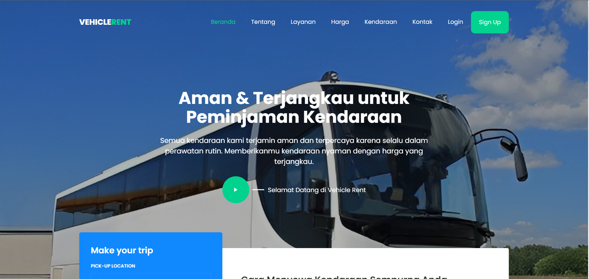

<!-- Improved compatibility of back to top link: See: https://github.com/othneildrew/Best-README-Template/pull/73 -->

<!--
*** Thanks for checking out the Best-README-Template. If you have a suggestion
*** that would make this better, please fork the repo and create a pull request
*** or simply open an issue with the tag "enhancement".
*** Don't forget to give the project a star!
*** Thanks again! Now go create something AMAZING! :D
-->

<!-- PROJECT SHIELDS -->
<!--
*** I'm using markdown "reference style" links for readability.
*** Reference links are enclosed in brackets [ ] instead of parentheses ( ).
*** See the bottom of this document for the declaration of the reference variables
*** for contributors-url, forks-url, etc. This is an optional, concise syntax you may use.
*** https://www.markdownguide.org/basic-syntax/#reference-style-links
-->
<!-- [![Contributors][contributors-shield]][contributors-url]
[![Forks][forks-shield]][forks-url]
[![Stargazers][stars-shield]][stars-url]
[![Issues][issues-shield]][issues-url]
[![MIT License][license-shield]][license-url]
[![LinkedIn][linkedin-shield]][linkedin-url]
-->

<!-- PROJECT LOGO -->
 

  

  <h3 align="center">Project Website 2</h3>

  

    Sebuah Project Website Mata Kuliah Pemrograman web STT Nurul Fikri
     
    <a href="https://github.com/othneildrew/Project-Web-2"><strong>Explore the docs »</strong></a>
     
     
    <a href="https://github.com/othneildrew/Project-Web-2">Front-end</a>
    ·
    <a href="https://github.com/othneildrewProject-Web-2/issues">Back-end</a>
    ·
    <a href="https://github.com/othneildrew/Project-Web-2/issues">UI/UX</a>
  

## Daftar nama kelompok
* Muhamad Aldi Ramdani
* Muhamad Nauval Ihsan
* Puspita Ayu Kusuma Dinata
* Marsha Nurhaliza

<!-- ABOUT THE PROJECT -->
## About The Project

[![Project Web 2]

Project Vehicle rent system. Membuat sebuah sistem peminjaman kendaraan dalam bentuk website tanpa database namun interaktif dengan menggunakan HTML, CSS, JavaScript dan menggunakan beberapa library serta framework online.

Apa saja yang dibuat:
* Landing Page website lengkap dengan detail dari tiap produk
* Login/register page serta bisa integrasi dengan javascript untuk menghubungkan ke halaman admin
* Admin dashboard back-end page untuk mengelola produk

Dan dari ketiga tugas utama kami, dari masing masing pointnya tentu akan bercabang dalam pembuatan sistem yang terintegrasi dan terstruktur. Tentunya
kami tidak bisa jika hanya sendirian dalam membuat itu semua. Maka dari itu, tiap dari kami memiliki tugasnya masing masing dalam membuat sebuah detail dan yang lainnya.

(<a href="#readme-top">back to top</a>)

### Built With

Untuk membuat sebuah sistem tersebut tentunya tidak mungkin jika tidak menggunakan library atau framework yang telah ada. Maka dari itu kami mengambil framework/library diantaranya:

* AdminLTE
* [![Bootstrap][Bootstrap.com]][Bootstrap-url]

(<a href="#readme-top">back to top</a>)

<!-- CONTACT -->
## Contact

Muhamad Aldi Ramdani - [@aldiramdhanl](https://instagram.com/aldiramdhanl) - ramdanialdi12r@gmail.com

Project Link: [https://github.com/aldiramdhan/Project-Web-2](https://github.com/aldiramdhan/Project-Web-2)

(<a href="#readme-top">back to top</a>)

<!-- ACKNOWLEDGMENTS -->
## Acknowledgments

Referensi

* [GitHub Pages](https://pages.github.com)
* [Bootstrap](https://bootstrap.com)
* [Dribble](https://dribble.com)
* [Mazure](https://.com)

(<a href="#readme-top">back to top</a>)

<!-- MARKDOWN LINKS & IMAGES -->
<!-- https://www.markdownguide.org/basic-syntax/#reference-style-links -->
[contributors-shield]: https://img.shields.io/github/contributors/othneildrew/Best-README-Template.svg?style=for-the-badge
[contributors-url]: https://github.com/othneildrew/Best-README-Template/graphs/contributors
[forks-shield]: https://img.shields.io/github/forks/othneildrew/Best-README-Template.svg?style=for-the-badge
[forks-url]: https://github.com/othneildrew/Best-README-Template/network/members
[stars-shield]: https://img.shields.io/github/stars/othneildrew/Best-README-Template.svg?style=for-the-badge
[stars-url]: https://github.com/othneildrew/Best-README-Template/stargazers
[issues-shield]: https://img.shields.io/github/issues/othneildrew/Best-README-Template.svg?style=for-the-badge
[issues-url]: https://github.com/othneildrew/Best-README-Template/issues
[license-shield]: https://img.shields.io/github/license/othneildrew/Best-README-Template.svg?style=for-the-badge
[license-url]: https://github.com/othneildrew/Best-README-Template/blob/master/LICENSE.txt
[linkedin-shield]: https://img.shields.io/badge/-LinkedIn-black.svg?style=for-the-badge&logo=linkedin&colorB=555
[linkedin-url]: https://linkedin.com/in/othneildrew
[product-screenshot]: images/screenshot.png
[Next.js]: https://img.shields.io/badge/next.js-000000?style=for-the-badge&logo=nextdotjs&logoColor=white
[Next-url]: https://nextjs.org/
[React.js]: https://img.shields.io/badge/React-20232A?style=for-the-badge&logo=react&logoColor=61DAFB
[React-url]: https://reactjs.org/
[Vue.js]: https://img.shields.io/badge/Vue.js-35495E?style=for-the-badge&logo=vuedotjs&logoColor=4FC08D
[Vue-url]: https://vuejs.org/
[Angular.io]: https://img.shields.io/badge/Angular-DD0031?style=for-the-badge&logo=angular&logoColor=white
[Angular-url]: https://angular.io/
[Svelte.dev]: https://img.shields.io/badge/Svelte-4A4A55?style=for-the-badge&logo=svelte&logoColor=FF3E00
[Svelte-url]: https://svelte.dev/
[Laravel.com]: https://img.shields.io/badge/Laravel-FF2D20?style=for-the-badge&logo=laravel&logoColor=white
[Laravel-url]: https://laravel.com
[Bootstrap.com]: https://img.shields.io/badge/Bootstrap-563D7C?style=for-the-badge&logo=bootstrap&logoColor=white
[Bootstrap-url]: https://getbootstrap.com
[JQuery.com]: https://img.shields.io/badge/jQuery-0769AD?style=for-the-badge&logo=jquery&logoColor=white
[JQuery-url]: https://jquery.com 
